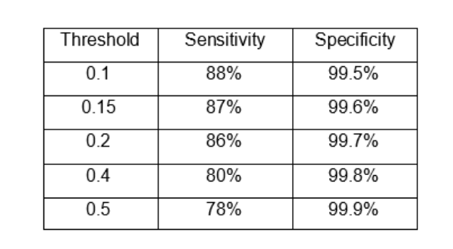
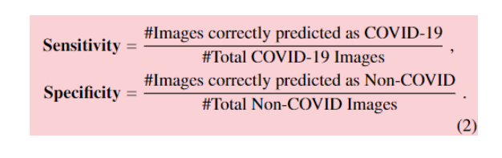

# Deep-Learning

## HW1

This assignment was an introduction to TensorFlow and PyTorch.

## HW2

In this assignment, We implemented a classifier for the MNIST dataset in Q3 and a classifier for cats and dogs in Q4. 

## HW3

In this assignment, We needed to overfit a model. Then, we tried to deal with the overfitting. 

## HW4

### Q5
First, I created the train, dev, and test sets with the given dataset. Then, I defined the data generators and the model. In the end, I trained the model and saved its predictions.

For the second part of this question, I loaded the mobilenet_v2 from Keras and added a custom layer at the end of it.

## HW6

### Q1:
I computed the Batch and Layer normalizations for a given matrix.

### Q3:
In this question, I implemented a self-supervised network by using CIFAR10. For this task, I keep the labels of only 20 samples per class. In other words, I had 200 labeled and 49800 unlabeled samples in my dataset and 10000 labeled samples in my test set. First, I tried to train a model by using 200 labeled samples and testing it with the test set. Then, I created a dataset for predicting the rotation degree by my unlabeled dataset. After that, I changed the last layer and put ten neurons to use the trained model in my main task.

Ultimately, I defined a functional model with Keras, which has multiple outputs. One was for predicting the class of the image, and the other was for predicting the rotation degree.

### Q4:
In the last question of this assignment, I needed to tune the hyperparameters of the given model with Keras tuner. I found three best options for the following parameters:
- number of convolutional blocks
- dropout rate
- learning rate
- number of neurons in the penultimate layer

Then, I trained the model with the best parameters and computed its accuracy and f1-score.
In the last part, I plot the confusion matrix.

## Project

In the final project of this course, I used data augmentation methods used in [The Effectiveness of Image Augmentation in Deep Learning Networks for Detecting COVID-19: A Geometric Transformation Perspective](https://www.frontiersin.org/articles/10.3389/fmed.2021.629134/full#:~:text=10.3389%2Ffmed.2021.629134-,The%20Effectiveness%20of%20Image%20Augmentation%20in%20Deep%20Learning%20Networks%20for,19%3A%20A%20Geometric%20Transformation%20Perspective&text=Chest%20X%2Dray%20imaging%20technology,to%20other%20non%2Dinvasive%20technologies.) in order to increase the number of samples in the dataset. Then, I used the squeeze net architecture from [Deep-COVID: Predicting COVID-19 from chest X-ray images using deep transfer learning](https://pubmed.ncbi.nlm.nih.gov/32781377/) and trained the model.

Here is our results:

 

The Sensitivity and Specificity measures are defined in the paper as follows:

 
